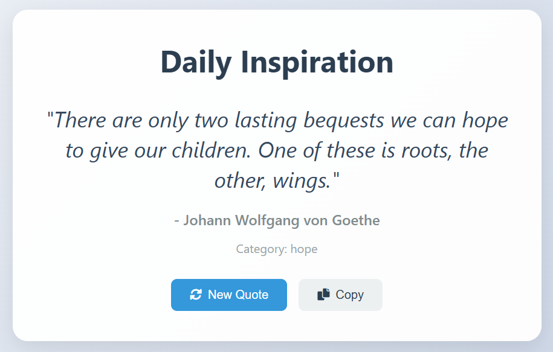

# [RandomQuotes](https://pathanin-kht.github.io/RandomQuotes/)
## Overviews
RandomQuotes is a web app that provides a random daily quote. Users can get inspired and easily copy the quote.

## Features
- Display a random quote every time the page is refreshed.
- Includes the author of the quote and relevant tags for categorization.
- A **"Copy"** button to easily copy the quote.

## Data Source
The quotes used in this project are from [Quotes Dataset](https://www.kaggle.com/datasets/akmittal/quotes-dataset) 

## Example

## License
This project is licensed under the [MIT License](LICENSE) - see the LICENSE file for details.

## Contact
For feedback or inquiries, feel free to reach out via [pathanin.kht@gmail.com](pathanin.kht@gmail.com).
